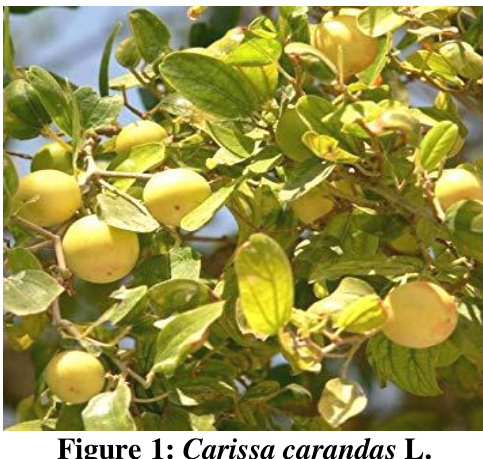

# A STUDY ON DIFFERENT PLANTS OF APOCYNACEAE FAMILY AND THEIR  MEDICINAL USES  Md. Shahidul Islam , Rasheda Akter Lucky  

Department of Pharmacy, University of science and Technology Chittagong (USTC), Foy’s Lake, Chittagong, Bangladesh.  

# Article Info:  

# Abstract  

The apocynaceae family is one of the most medicinally diverse families in the plant  kingdom and is a rich source for drugs that have found use both traditionally and in  conventional medicine. The medicinal activity of these plants was due to the  presence of alkaloids which were either indoline alkaloids or steroidal alkaloids.  The family Apocynaceae consists of tropical trees, shrubs and vines. Characteristic  features of the family are that almost all species produce milky sap. In traditional  medicine, Apocynaceae species are used to treat gastrointestinal ailments, fever,  malaria, pain and diabetes, including skin and ecto-parasitic diseases. Some are  important timber species while many are planted as ornamentals. Non-medicinal  uses include food, poisons, fodder, wood, ornamentals, dye and perfume. A total of  4600 species under 415 genera belonging to the family Apocynaceae were  collected and identified. Species of Apocynaceae have been reported to possess  anticancer and anti malarial properties. Species having cytotoxic activity include  those of Cathar an thus, Nerium, Plumeria, Taber nae montana and Ich no carpus.  Cathar an thus roseus is the most medicinally important plant in this family due to  its use in the treatment of various types of cancers, other agents that have been  derived from this family include the alkaloids reserpine and res c in amine which  have been used against hypertension, and others are the cardiac glycosides.  Keywords:  Activity, apocynaceae, medicinal plants, uses.  

  

Article History:  Received: 7 December 2018  Reviewed: 11 January 2019  Accepted: 3 March  2019  Published: 15 March 2019  

Cite this article:   Islam MS, Lucky RA. A study on different  plants  of  apocynaceae  family  and  their  medicinal  uses.  Universal  Journal  of  Pharmaceutical Research 2019; 4(1): 40-44.   https://doi.org/10.22270/ujpr.v4i1.235  

\*Address for Correspondence:  Md. Shahidul Islam,  Assistant Professor,  Department of Pharmacy, University of Science  and  Technology  Chittagong  (USTC),  Bangladesh. Tel: +8801815-579040, E-mail: s_i_liton@yahoo.com  

are totally dependent on herbal medicines 2 . Human  beings have depended on nature for their simple  requirements as being the sources for   medicines,  shelters, food stuffs, fragrances, clothing, flavors,  fertilizers and means of transportation throughout the  ages 3 . For the large proportions of world’s population  medicinal plants continue to show a dominant role in  the healthcare system and this is mainly true in  developing countries, where herbal medicine has  continuous history of long use. The development and  recognition of medicinal and financial aids of these  plants are on rise in both industrialized and developing  nations 4 . Some contain active ingredients (bioactive  components or substances) obtained from plants.  Through recent researches, plant-derived drugs were  discovered from the study of curative, therapeutic,  traditional cures and most especially the folk  knowledge of indigenous people and some of these  claims and believe of people are irreplaceable despite  the recent advancement in science and technology 5 . In  addition, in the USA, more than   $40\%$   of the population  recently reported using complementary and  alternative  medicines , including botanical dietary supplements. In  the past decade, a remarkable effort has been deployed  

# INTRODUCTION  

Plant is an important source of medicine and plays a  key role in world health. Medicinal herbs or plants  have been known to be an important potential source of  therapeutics or curative aids. The use of medicinal  plants has attained a commanding role in health system  all over the world. This involves the use of medicinal  plants not only for the treatment of diseases but also as  potential material for maintaining good health and  conditions. Many countries in the world, that is, twothird of the world’s population depends on herbal  medicine for primary health care. The reasons for this  is because of their better cultural acceptability, better  compatibility and adaptability with the human body  and pose lesser side effects 1 . From records, most of the  used drugs contain plant extracts. Different types of  plants used to treat various types of diseases that reveal  the most up to date findings in understanding of  biological significance of their bioactive compounds  used. Recently dramatic changes have taken place in  the health care system of world population through the  development of science, technology and medical  science but till to day 400 crores of people of the world  

leading to the isolation of many bioactive drugs from  plants. Generally, the synthetic products are considered  as unsafe while the plant products appear to symbolize  the safety. Nonetheless, the safety, dosage and  potential interactions with standard conventional  therapies are categorically needed because the plant  material could be toxic due the presence of naturally  occurring toxic constituents, heavy metals, toxins,  pesticides, or bacteria 6 . The medicinal plants of  Bangladesh South Asian countries have a large number  of valuable medicinal plants naturally growing mostly  in fragile ecosystems that are predominantly inhabited  by rural poor and indigenous community. In  Bangladesh 5,000 specie s of angiosperm are reported  to occur. The number of medicinal plants included in  the ‘materia medica’ of traditional medicine in this  subcontinent at present stands at about 2,000. More  than 500 of such medicinal plants have so far been  enlisted as growing in Bangladesh Dhaka, Rajshahi,  Syhlet and Chittagong division is rich in medicinal  plants 7 . Apocynaceae  is a large family of  flowering  plants   which  includes  trees ,  shrubs ,  herbs ,  stem  succulents ,  and  vines ,  commonly  known  as  the dogbane family, (Greek for "away from dog" since  some taxa were used as dog poison). The former family  As cle pia dac eae (now known as Asclepiadoideae) is  considered a subfamily of Apocynaceae 8  and the  Apocynaceae has 43 Genera and 170 species accepted  taxa overall. But  Carissa carandas  L(Christ’s Thorn),  Cathar an thus roseus  (L.)  G. Don  (Periwinkle),  Nerium   oleander  Linn.(oleander),  Plumeria alba  L. (pagoda  tree),  Taber nae montana divaricata  (L.) R.  Br ex  Roem .(wax flower),  Ich no carpus frutescens  (L.) R. Br.  (Black creeper) are important plants of this family  because these plants shown different activity for  different diseases. These plants have remarkable  medicinal and traditional uses.  

Medicinal plants are very much related to our health  culture. Most  of the people of Bangladesh are directly  or indirectly depends medicinal plants for health  problem.The review aims to understand the possibility  of medicinal plant  as a sustainable livelihood option.  The specific objectives are to explore the use of locally  produced medicinal plants, to explore the market of  medicinal plants in Bangladesh, to know about of the  habitat, diversity of medicinal plant, to know about the  conversation of medicinal plant, to know about the uses  of medicinal plant against several diseases.  

# CARISSA CARANDAS  L.  

   Botanical name :  C. carandas  L.     Binomial Name :  Carissa carandas  L.    Local name: Karamcha     Family:  Apocynaceae     Status of occurrence:  Common  Taxonomic description  Large armed shrub, with long, stout, sharp, horizontal  spines at the base of the branchlets. Leaves   $3.8{\cdot}7.5~\mathrm{cm}$    long, coriaceous, elliptic or obovate, obtuse. Flowers  white  Habit:  Generally shrubs  Habitat:  Dry, sunny place, roadsides and thickets  Flower colour:  Red, yellow and pink  Flowering season:  March- November  

  

# Mode of Action  

The plant materials were collected and the leaves were  collected for experiment and experimental results have  established a   p harm a co logical evidence 9 .  

Parts Utilized  Leaves, fruits, flower, root and root bark.  

Table 1: Chemical composition of  Carissa carandas  L. 
  

# Medicinal uses  

   The  root  is  antis corbu tic,  stomachic  and  an the lm in tic. Decoction of the leaves is useful in  early stages of remittent fevers. 

    Unripe fruit is astringent, appetizer and anti pyre tic.  Ripe fruit is cooling and acid; useful in bilious  complaints.  

   Root paste is insect repellent; paste of root bark is  useful in diabetic ulcer. 

     The roots of the plant are heavily branched,  making it valuable for stabilizing eroding slopes. It  has medicinal value too; it is taken for urine-related  problems.  

# CATHAR AN THUS ROSEUS  L.  

   Botanical name:   C. roseus  (L.) G. Don.     Binomial Name:   Cathar an thus roseus  (L.) G.  Don   Local name: Nayantara    Family:  Apocynaceae     Status of occurrence:  Very common   Taxonomic description  Habit:   Herb or sub-shrub.   Habitat:  Gardens where it is cultivated as an  ornamental plant.   Flower colour:  White and pink  Flowering season:  Flowering almost throughout the  year.  Mode of Action  Healthy plant Red Periwinkle was collected and this  used for further phytochemical analysis 10 .  Parts Utilized  Whole plant, flowers leaves and roots.  

  

# Medicinal uses  

   The plant has been used as a folk remedy for  diabetes.      The root is considered tonic and stomachic.      Alkaloids also possess hypertensive, sedative and  tranquillizing  properties.  They  also  cause  relaxation of plain muscles and depression of the  central nervous system.  

    Leaves and latex are given for blood dysentery  and piles.  

# NERIUM OLEANDER  L.  

   Botanical Name:   N. oleander  Linn     Binomial Name:   Nerium oleander  Linn   Local name: Korobi    Family:  Apocynaceae     Status of occurrence:  Common  Taxonomic description  Habit:  Shrub  Habitat:  Grows in the clayey, loamy and sandy soil  Flower colour:   red, purple, pink, and orange colour  Flowering season:  Flowering: January-July  

  
Figure 3:  Nerium oleander  Linn.  

Mode of Action  The samples including leaves and stems of  N. oleander  were collected. The plant materials were used for  phytochemical analysis and antimicrobial activity 11 .  Parts Utilized  Leaves, flowers, roots and seeds.  Medicinal uses      All parts of the plants are poisonous.      Leaf decoction is used to reduce swellings.      Macerated leaves are used for itch and fall of hair.      The flowers are good for inflammations, chronic  pains in the muscles and the joints, lumbago,  headache, and scabies.  

Table 2: Chemical composition of  Cathar an thus roseus  (L).  
  

# PLUMERIA ALBA  L.  

 Botanical   Name: P. alba L. 

   Binomial Name:   Plumeria alba  L. 

    Local name:  Kathgolap  

    Family:  Apocynaceae     Status of occurrence:  Common  

Taxonomic description:   Habit:  Evergreen shrub  Habitat:  Grown in rich, dry to medium moisture,  coastal thickets and limestone forests.  Flower colour:  White  Flowering season:  May-November  

Mode of Action   The stem bark were collected. This extract showed the  antibacterial activity 12 .  

Parts Utilized  Seed, leaves, flowers and roots.  

# Medicinal uses:  

   In addition, the flowers are edible and eaten as  fritters, while the heart of the wood is part of a  traditional medical preparation taken as a  laxative .     The root bark is depurative and purgative, causing  thirst. It is used in the treatment of herpes and  syphilis.     The root bark is used externally as a lotion on  syphilitic ulcers, administered as powder macerated  in sugar-water, wine.     The latex from the stem is caustic. It is used for  treating ulcers, dartre (skin diseases) and scabies.  

   The seeds are used in the treatment of dysentery.  

  
Figure 4:    Plumeria alba  L.: Leaves, flowers  

Table 3: Chemical Composition of  Plumeria alba 
  

  

# TABER NAE MONTANA DIVARICATA  L.  

   Botanical Name:   T. divaricata  (L.) R. Br ex  Roem     Binomial Name:   Taber nae montana divaricata   (L.) R. Br ex Roem   Local Name: Tagar    Family:  Apocynaceae     Status of occurrence:  Rare  

  
Figure 5:  Taber nae montana divaricata  (L.)  

Taxonomic description    Habit:  A Small shrub with milky juice.     Habitat:  Grown as brushwoods, sparse forests,  house/glasshouse plant.  Flower colour : White  Flowering season:  May-January.  Mode of Action  The leaves of Wax Flower were collected and the  extract showed anticancer activity 13 .   Parts Utilized   Root, bark, leaves, sap and flowers.  Medicinal uses      Grape jasmine is widely used as a medicinal herb in  the tropics and the plant may well be classified as a  panacea for gastro-intestinal and skin affections.     The roots are astringent     A decoction is used in the treatment of diarrhoea  and abdominal complaints.      The roots, leaves, and flowers are all used in the  treatment of snake and scorpion poisoning. An  infusion is applied as a remedy for jungle fever.     The roots are used in modern medicine to treat  hypertension, headache and scabies.  

# CONCLUSIONS  

The present study is to explore medicinal aspects of  this family and focusing on medicinal plants and their  local uses for the healthcare. The ethno botanical also  point out some specific medicinal plant species and  their properties to the local inhabitants who are  unknown from value of medicinal plants in the  environment. The use of herbal medicine for treatments  is one component of balancing body systems. In  conclusion, it was obtained that different plant of this  family have showed different activities like antmicrobial, antioxidant, anti-bacterial, anti diabetic, antitumor, anti-inflammatory, anti-asthmatic activity, anticancer activity, anti-ulcer activity, wound healing  activity, anti-convulsant activity, biological activity,   anti-diarrheal activity, anti-pyretic activity, pharmacological activity etc. in human being and animal.  

# ACKNOWLEDGEMENTS  

The authors extend their thanks and appreciation to the  University of Science and Technology Chittagong  (USTC), Bangladesh to provide necessary facilities for  this work.  

# AUTHOR'S CONTRIBUTION  

Islam MS:  writing original draft, methodology.  Lucky  RA:  investigation, formal analysis, conceptualization.  Final manuscript was read and approved by all authors.  

# DATA AVAILABILITY  

The data and material are available from the  corresponding author on reasonable request.  

# CONFLICT OF INTEREST  

Authors have declared that no conflict of interest is  linked with this work.  

# REFERENCES  

1.   Sandberg F, Corrigan D. Natural Remedies. Their Origins  and Uses. Abingdon: Taylor and Francis; 2001.  

 2.   Rapanarivo SHJV, Le euwe nberg AJM. "Taxonomic revision  of P achy podium. Series of revisions of Apo cyn ace ac  XLVIII. In Rapanarivo SHJV. P achy podium (Apocynaceae):  taxonomy, habitats and cultivation. Balkema. 1999; 1–82. 

 3.   Schulz V, Hänsel R. Tyler VE. Rational Ph y to therapy. A  Physician’s Guide to Herbal Medicine. 4 th  ed. Berlin:  Springer-Verlag; 2001, 306. 

 4.   WHO. Regulatory situation of herbal medicines. Geneva,  Switzerland. A worldwide review 1998; 1-5. 

 5.   Ahn, K. The worldwide trend of using botanical drugs and  strategies for developing global drugs 2017; BMB Reports.  50  (3):  111–116.  doi:10.5483/BMBRep.2017.50.3.221.  PMC5422022. PMID 27998396.  https://doi.org/10.5483/bmbrep.2017.50.3.221 

 6.   Medicinal and aromatic plants trade programme. Traffic.org.  Re1. WHO. Regulatory situation of herbal medicines; 1998.  

 7.   Srivastava J, Lambert J Vietmeyer N. Medicinal plants: An  expanding role in development. World Bank. Agriculture  and Forestry Systems, Washington, D.C 1996. 

 8.   Nazia N, David J, Goyder, James J, Clarkson, Tariq  Mahmood, Mark W. Chase. The taxonomy and systematics  of Apocynaceae: Where we stand in 2012. Bot J Linnean Soc  2013; 171(3):482–490.  https://doi.org/10.1111/boj.12005  

 9.   Rahman AHMM. Ethno-medicinal investigation on ethnic  community in the northern region of Bangladesh. Am J Life  Sci 2013; 1:77-81.  https://doi.org/10.11648/j.ajls.20130102.19 

 10.   Rahman AHMM. Ethno-medico-botanical investigation on  cucurbits of the Rajshahi division. Bang J Med Plan Stud  2013:1:118-125. 

 11.   Bingtao Li, Le euwe nberg, Antony JM, Middleton, David J,  Wu  ZY,  Raven  PH.,  eds. " Ich no carpus  frutescens ,  Apocynaceae,  Vol.  16". Flora  of  China.  Online  access. eFloras.org. St. Louis, MO and Cambridge, MA.:  Missouri Botanical Garden Press and Harvard University  Herbaria 2008; Retrieved 9 Mar 2013.  

 12.   Adhikari, BS,  et al.  Medicinal plants diversity and their  conservation status in wildlife institute of India (WII)  Campus, Dehradun. Ethno botanical Leaflets 2010; 14 46-83. 

 13.   Dash DK,  et al.  Evaluation of he pato protective and  antioxidant activity of  Ich no carpus frutescens  (Linn.) R.Br.  on paracetamol-induced he pato toxicity in rats. Tropical J  Pharm Res 2007; 6:3 755-65.  https://doi.org/10.4314/tjpr.v6i3.14656  