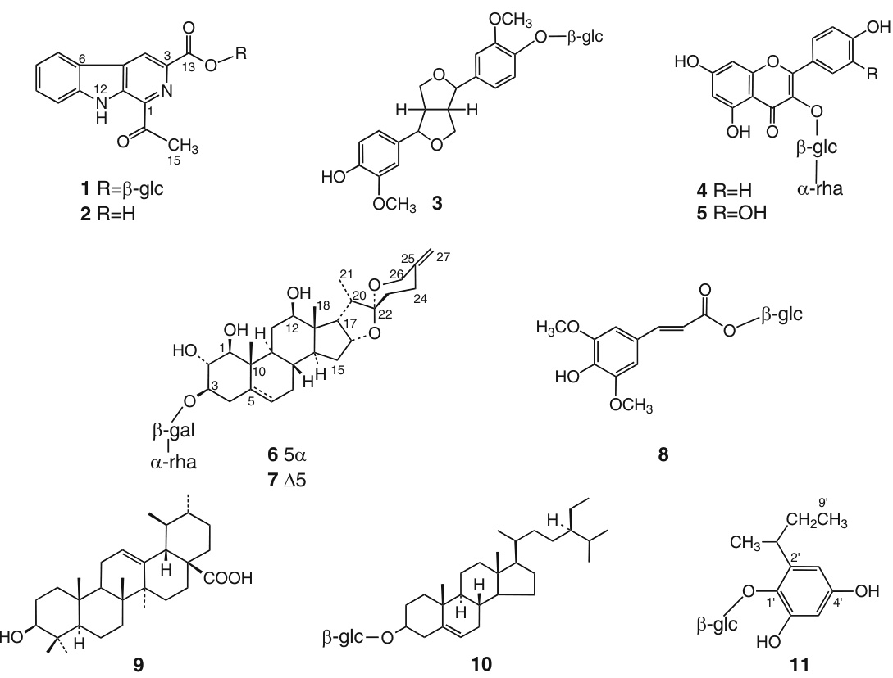
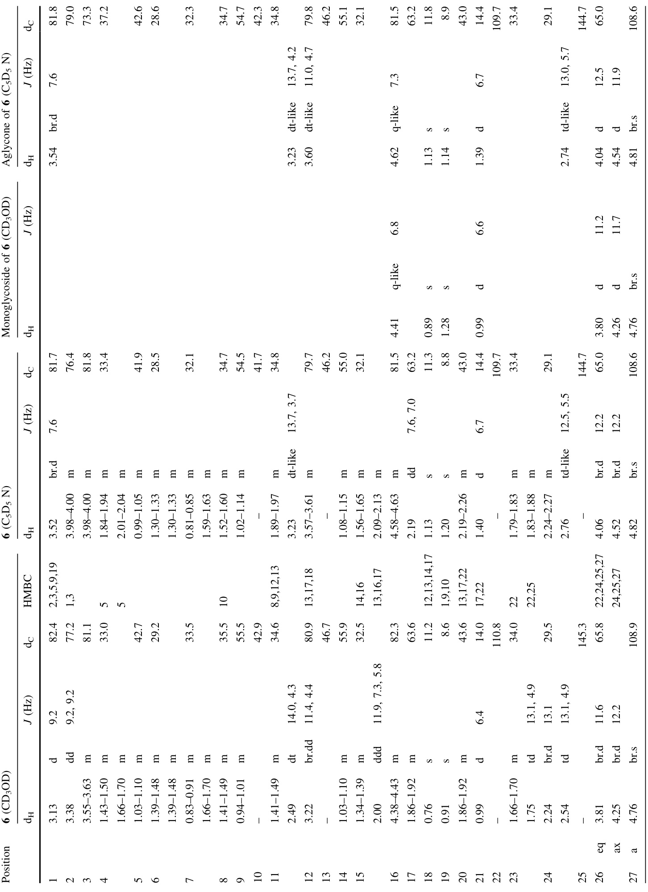
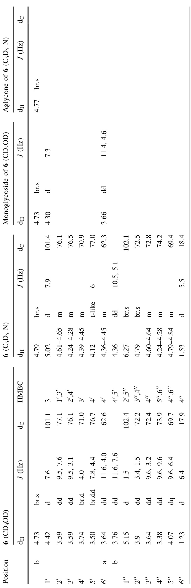
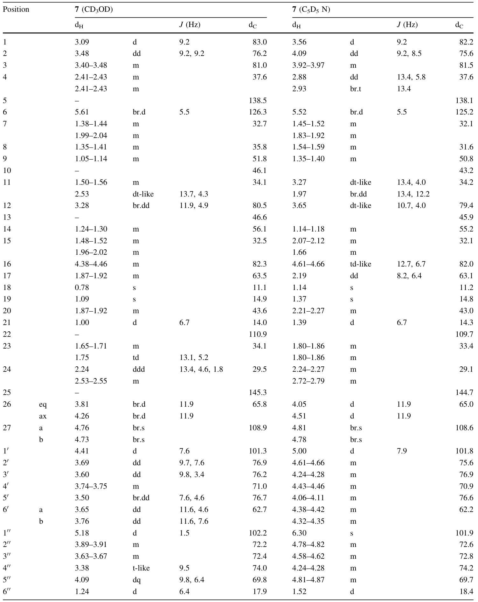

# Anti-in amma tory and analgesic components from ‘‘hierba santa,’’ a traditional medicine in Peru  

Marii Kawano  $\cdot$  Mayumi Otsuka  $\cdot$  Kazuhiro Umeyama  $\cdot$  Mikio Yamazaki  Æ Tetsuo Shiota  $\cdot$   Motoyoshi Satake  $\cdot$   Emi Okuyama  

Received: 1 September 2008 / Accepted: 4 November 2008 / Published online: 6 December 2008  $\copyright$   The Japanese Society of P harm a cog nosy and Springer 2008  

Abstract ‘‘Hierba santa,’’ a Peruvian herbal medicine, is used to alleviate many symptoms, including headache, hemorrhoids, fever, and rheumatism. Several  Cestrum species are said to be the origin of hierba santa. Three lots of hierba santa:  Cestrum auric ul atum  (herb 1 and herb 2) and    $C.$  . he di und in um  (herb 3), which were purchased from Peruvian markets at Cuzco (Andes area) and Equitos (Amazon area), respectively, were examined for their p harm a co logical activities and active components. Herbs 1–3 showed anti-in amma tory and analgesic activities in the in vivo writhing inhibition test in mouse and inhibited  

M. Otsuka  $\cdot$   K. Umeyama  $\cdot$   M. Yamazaki Laboratory of Natural Products Chemistry, Faculty of Pharmaceutical Sciences, Chiba University, 1-33 Yayoi-cho, Inage-ku, Chiba 263-8522, Japan  

prostaglandin   $\mathrm{E_{1^{-}},~E_{2^{-}}}$  , or ACh-induced contractions of guinea pig ileum in the Magnus method. Activity-based separation of each extract yielded cest ru mines A and B, c estrus ides A and B, a mixture of   $(+)$  - and   $(-)$  -pino resin ol glucosides, nicot i or in, rutin, sinapoyl glucose, urso- lic acid,  $\beta$  -sitosteryl glucoside, and 2- sec -butyl-4,6- di hydroxy phenyl $\beta$  - D -g lu copy rano side. Among them, cestrumine A and c estrus ides A and B are new compounds. All three lots of hierba santa do not contain exactly the same active components.  

Keywords Hierba santa  $\cdot$   Cestrum  $\cdot$   Anti-in amma tion  $\cdot$  Analgesic      $\beta$  -Carboline  $\cdot$   Spiro stan ol  

# Introduction  

As part of our long-term research on traditional medicine, we investigated ‘‘hierba santa,’’ a Peruvian herbal medicine. Hierba santa or ‘‘holy weed’’ is used to alleviate many kinds of symptoms in Peru. It is also used in magical rituals to cure diseases and to protect against bad luck. The leaf decoction is taken orally to treat fever, typhoid fever, rheumatism, cough, bronchitis, colic of the stomach, high blood pressure, and diabetes [ 1 – 3 ]. The decoction is also applied externally to treat headache and hemorrhoids [ 1 ,  2 ], and the crushed leaves are used to disinfect wounds [ 4 ]. It is said that this herb is incensed to cure colds or magically to send away bad shadows [ 3 ].  

Such plants as  Cestrum auric ul atum ,  C. he di und in um , and  C. coriaceum  are listed as the origin of hierba santa in herbal medicine books [ 5 – 7 ]. The same plants are also known by another local name: ‘‘hierba hedionda.’’ One herbal medicine book states that hierba santa and hierba hedionda are the same [ 5 ]. According to Professor A. Tupayachi Herrera of Universidad Nacional de San Antonio Abad del Cuzco,  C. coriaceum  is commonly used as hierba santa and  C. auric ul atum  as hierba hedionda at Cuzco in Andes. A herb sold as hierba santa at a market in Equitos, a city in Amazon, was identified as  C. hediundinum  by Mr. J. Ruiz (Herbario Ethnobota´nico Amazo´nico). Several plants of the genus  Cestrum  (Solanaceae) grow in Peru and they are expected to have similar p harm a co logical activities, such as anti-in amma tory and analgesic activities. Hierba santa, therefore, seems to have a few  Cestrum plants as its origin.  

We purchased three lots of hierba santa from local markets at Cuzco (Andes area) and Equitos (Amazon area) and identified them as  C. auric ul atum  (herb 1 and herb 2) and  C. he di und in um  (herb 3), respectively. We present herein the active components in hierba santa as well as their anti-in amma tory and analgesic activities.  

# Results and discussion  

Activity of extracts  

Herb 1, herb 2, and herb 3 were extracted with methanol at room temperature. After evaporation in vacuo, methanol extracts (ext. 1, 2, and 3) were obtained and their analgesic activities in vivo were evaluated using the acetic-acid-induced writhing inhibition test in mice. The three extracts showed   $44\%$   (  $(P<0.05\$  ,   $2.0~\mathrm{g/kg})$  ,   $49\%$   $(P<0.01\$  ,   ${3.0~\mathrm{g/kg}})$  ), and   $32\%$     $P<0.01$  ,   $1.0~\mathrm{g/kg}$  ) inhibition, respectively.  

Ext. 1–3 were also evaluated in vitro for their ability to inhibit prostaglandin (PG)- and acetylcholine (ACh)- induced contractions of guinea pig ileum using the Magnus method. Ext. 3 inhibited   $\mathrm{PGE_{1}\mathrm{.}}$  -,   $\mathrm{PGE_{2}}.$  - or ACh-induced contraction at a concentration of   $3\,\times\,10^{-4}~\mathrm{g/ml}$  . Ext. 1 inhibited   $\mathrm{PGE_{1^{-}}}$   or ACh-induced contraction but not   $\mathrm{PGE}_{2}.$  - induced contraction at   $3\,\times\,10^{-4}~\mathrm{g/ml}$  . Ext. 2 inhibited only ACh-induced contraction at   $\mathrm{1\times10^{-3}~g/m l}$  .  

All three extracts inhibited neither substance-P-induced contraction of guinea pig ileum nor norepinephrineinduced contraction of rat aorta at the concentration of  $3\,\times\,10^{-4}~\mathrm{g/ml}$  .  

The results showed that the three lots of hierba santa, herb 1, herb 2, and herb 3, have significant analgesic activity (probably anti-in amma tory) in vivo, but their in vitro inhibitory activities against PG- and ACh-induced contractions were not the same.  

Activity-based separation of ext. 3  

The separation of ext. 3 was carried out by monitoring p harm a co logical activity, such as ability to inhibit aceticacid-induced writhing in mouse by oral administration, and ability to inhibit guinea pig ileum contractions induced by  $\mathrm{PGE_{1}}$  ,   $\mathrm{PGE}_{2}$   or ACh.  

Ext. 3 was chromatograph ed on DIAION HP-20 and the methanol eluate yielded precipitate  1 . The detailed activities of the isolated compounds are discussed later. The mother liquor, fr. 1-A-sol, inhibited writhing in mice (  $(40\%$  ,  $P<0.01]$  ) at   $1\ \mathrm{g/kg}$   and inhibited contraction induced by PGs or ACh at   $\mathrm{\Omega}1\,\times\,10^{-4}~\mathrm{g/ml}$  . Fr. 1-A-sol was also evaluated for its ability to inhibit electrical-stimulation-induced contractions of guinea pig ilea. The inhibitory effect was observed at a concentration of   $\mathrm{1\times10^{-3}~g/m l}$   and was not reversed by naloxone, an opioid antagonist.  

Fr. 1-A-sol was further separated by partition with chloroform,    $n$  -butanol, and water, in that order. From the chloroform fraction, compound  2  was obtained as an insoluble solid by the addition of methanol. The mother liquor of  2 , which showed the ability to inhibit writhing (  $26\%$  ,    $P<0.05$  ,   $200~\mathrm{mg/kg})$   and to inhibit   $\mathrm{PGE_{1}}.$  - or ACh  induced contraction at concentrations of   $1\,\times\,10^{-4}$  and  $3\,\times\,10^{-5}~\mathrm{g/ml}$  , respectively, was separated on a silica gel flash column by gradient elution with chloroform–methanol–water. Two of the fractions, the 10:1:0.1 and 7:1:0.1 fractions, were independently purified by Sephadex LH-20 column chromatography to give  3  together with  2 .  

The  $n$  -butanol fraction of fr. 1-A-sol was dissolved in methanol to yield  1  as an insoluble precipitate. The mother liquor was further separated because it was able to inhibit writhing   $33\%$  ,  $P<0.05)$  ) in mice at a dose of   $300~\mathrm{mg/kg}$  and to inhibit PG- or ACh-induced contractions of guinea pig ileum at a concentration of   $3\,\times\,10^{-5}~\mathrm{g/ml}$  . Separation on a DIAION HP-20 column with methanol–water as eluent gave fr. 4-A–fr. 4-D. After silica gel flash column chromatography of fr. 4-D with chloroform–methanol– water gradient, the fractions were repeatedly separated to afford  4 ,  6 , and  7 , together with  1  and  3 . Fr. 4-B and fr. 4-C were independently separated by LH-20 (methanol) and/or octadecyl silica gel (ODS) HPLC (methanol–water). From them,  8 , and  4  and  5  were obtained, respectively.  

Compound  1  was obtained as pale yellow needles, m.p.  $271–273^{\circ}\mathrm{C}$  , and its molecular formula,   $\mathrm{C_{20}H_{20}O_{8}N_{2}}$  , was   established from  $m/z~417.1276~[\mathrm{M+H}]^{+}$  by HR-FAB-MS. Although  1  was negative in the Drag end orff test, it was positive in the Ehrlich test, suggesting that  1  is an indole alkaloid. The    $^{13}\mathrm{C}$  -NMR spectral data of  1  revealed signals of a carbonyl group at  $\delta\,201.0$  ; an ester carbonyl at  $\delta\;163.4$  ; 11 aromatic carbons at  $\delta$   113.5, 120.3, 121.1, 121.7, 122.2, 129.4, 131.3, 135.0, 135.1, 135.6, and 142.3; a sugar moiety at    $\delta~60.6$  , 69.5, 72.7, 76.5, 78.0, and 95.3; and a methyl group at    $\delta\ 25.6$  . The    $^1\mathrm{H-NMR}$   spectra showed signals due to an  ortho -substituted aromatic ring at    $\delta\ 7.38$  (1H, td,  $J=8.0$  ,   $0.9~\mathrm{Hz}$  ; 8-H), 7.65 (1H, ddd,  $J=8.3$  , 8.0,

  $1.1~\mathrm{Hz}$  ; 9-H), 7.87 (1H, d,    $J=8.3~\mathrm{Hz}$  ; 10-H), and 8.46 (1H, d,  $J=8.1~\mathrm{Hz}$  ; 7-H), and an isolated proton at    $\delta\ 9.23$   $(1\mathrm{H},\mathrm{s};4–\mathrm{H})$  ). The signal at  $\delta$   12.34 (1H, s; 12-H) was assigned to an imino proton as the compound was predicted to have no phenolic OH based on the negative result of the ferric chloride test. In the HMBC spectrum, cross peaks were observed between    $\delta\ 12.34$   and    $\delta\ 131.3$   (C-5), 120.3 (C-6), 142.3 (C-11), and 135.1 (C-13). HMBC correlations were also observed between    $\delta~9.23$   (4-H) and    $\delta\ 120.3$   (C-6), 135.1 (C-13), and 163.4 (C-16), and between  $\delta\,2.85$   (3H, s;   $\mathrm{15-H}_{3}$  ) and    $\delta\ 201.0$   (C-14) and 135.6 (C-1). From these data, 1,3- substituted  $\beta\cdot$  -carboline was estimated. The g lu copy rano side unit was elucidated from the    $^1\mathrm{H}.$  -NMR signals at  $\delta\,3.23$   (1H, td,    $J=8.7$  ,  $5.3~\mathrm{Hz}$  ;   $\mathrm{4^{\prime}–H}$  ), 3.33–3.39 (2H, m;   $3^{\prime}$  -H,   $_{5^{\prime}\mathrm{-H}}$  ),

 3.43 (1H, td,  $J=8.3$  ,   $5.4~\mathrm{Hz}$  ;   $2^{\prime}\mathrm{-H}$  ), 3.51 (1H, dt,  $J=12.0$  ,

  $5.9\ \mathrm{Hz}$  ;   $_{6^{\prime}\mathrm{-}\mathrm{H}}$  ), 3.71 (1H, ddd,  $J=12.0$  , 5.9,  $2.1~\mathrm{Hz}$  ;   $_{6^{\prime}\mathrm{-}\mathrm{H}_{c}}$  ,

 4.65 (1H, t,  $J=5.9~\mathrm{Hz}$  ;  $6^{\prime}$  -OH), 5.08 (1H, d,  $J=5.6~\mathrm{Hz};4^{\prime}$  OH), 5.19 (1H, d,    $J=4.9~\mathrm{Hz}$  ;   $_{3^{\prime}\mathrm{OH}}$  ), 5.45 (1H, d,  $J=5.1~\mathrm{Hz}$  ;   $2^{\prime}\mathrm{-OH)}$  ), and 5.74 (1H, d,    $J=8.0~\mathrm{Hz}$  ;   $\mathrm{1^{\prime}–H}$  , together with    $^{13}\mathrm{C-NMR}$   data. The coupling constant of the anomeric proton at    $\delta\;5.74$     $J=8.0~\mathrm{Hz})$   indicated a    $\beta$  -con- figuration. The position of the glucosyl moiety at C-16 was determined from the HMBC correlation between    $\delta~5.74$   $\mathrm{{(1^{\prime}{-}H)}}$   and    $\delta\;163.4$   (C-16).  

Compound  1  was acid-hydrolyzed to yield  D -glucose and an aglycone, which was identical with  2 . The structure of the aglycone, 1-acetyl-  $\beta$  -carboline-3-carboxylic acid, was already reported in  Vestia lycioides  (Solanaceae) [ 8 ]. After the aglycone was esterified with d icy clo hex yl carbodiimide, dimethyl amino pyr i dine, and methanol, the methyl ester was identified as 1-acetyl-3-meth oxy carbonyl $\beta$  -carboline, which was isolated from    $V.$  . lycioides  [ 9 ], by comparison with published data [ 9 ,  10 ]. Therefore, compounds  1  and  2 , named cest ru mines A and B, were determined as    $\beta$  - D -g lu copy rano syl-1-acetyl $\cdot\beta$  -carboline-3- carboxyl ate and the des g lu co side, respectively (Fig.  1 ).  

Compound  6  is a white powder,   $[\alpha]_{\mathrm{D}}^{20}\ -53^{\circ}$  , and its molecular formula,   $\mathrm{C_{39}H_{62}O_{15}}$  , was determined from    $m/z$  793.3989  $[\mathbf{M}+\mathbf{N}\mathbf{a}]^{+}$  by HR-FAB-MS. The  $^1\mathrm{H-NMR}$  spectrum showed signals for two tertiary methyl groups at  $\delta\ 0.76$   (3H, s;   $\mathrm{18-H}_{3}$  ) and    $\delta\ 0.91$   (3H, s;   $\mathrm{{19-H_{3}}}$  ), a sec- ondary methyl at  $\delta\,0.99$   $)\;(3\mathrm{H},\mathrm{d},J=6.4~\mathrm{Hz};21{\cdot}\mathrm{H}_{3})$  , and an exo methylene at    $\delta\;4.79$   and 4.82 (each 1H, br.s;   $\mathrm{27-H}_{2}$  ). In the    $^{13}\mathrm{C-NMR}$   spectrum, the signal for the spiroketal quaternary carbon was observed at    $\delta\ 110.8$   (C-22) and those for one terminal double bond, at    $\delta\ 108.9$   (C-27) and 145.2

 (C-25). Signals indicating the presence of a glucose moiety

  $[\delta~101.1$   (C-1 0 ),  $\delta\;77.1$   (C-2 0 ),  d  76.1 (C-3 0 ),  d  71.0   $\mathrm{(C-4^{\prime})}$  ,

  $\delta\ 76.7\ \mathrm{(C}{-}5^{\prime})$  , and    $\delta\ 62.6\ (\mathrm{C}{\cdot}6^{\prime})]$   and rhamnose   $[\delta~102.4$   $\mathrm{(C-}1^{\prime\prime})$  ,  d  72.2   $\mathrm{(C}–2^{\prime\prime})$  ),  d  72.4   $\mathrm{(C-}3^{\prime\prime}\mathrm{)}$  ,  d  73.9   $\mathrm{(C-}4^{\prime\prime}\mathrm{)}$  ,    $\delta\ 69.7$   $(\mathbf{C}{-}5^{\prime\prime})$  , and  d  17.9   $\mathrm{(C–}6^{\prime\prime})]$   also appeared in the    $^{13}\mathrm{C}\mathrm{-}\mathrm{NMR}$  spectrum. These data suggested that  6  is a steroidal saponin having    $\Delta25(27)$   spirostene with two hexose units.  

The    $^{13}\mathrm{C}\mathrm{-}\mathrm{NMR}$   data of  6  were similar to those of   $1\beta$  ,  $2\alpha$  -dihydroxy-  $.5\alpha$  -spirost-25(27)-en-  $.3\beta$  -yl- O - a - L -rhamno- pyranosyl-(  $_{1\rightarrow2}$  )-  $\cdot\beta$  - D -gala c to pyr a no side [ 11 ] from  Cestrum send ten eri a num , except for the signals assigned to protons in the C-ring. The existence of a hydroxyl group in C-ring of  6 was estimated and the position of C-12 assigned to    $\delta_{\mathbf{C}}\,80.9$  

  
Fig. 1  Isolated compounds from three lots of hierba santa. Compounds  1 – 8  were isolated from herb 3,  9  and  10  from herb 2, and  11  from herb 1, which contained also  2  and  9  

and    $\delta_{\mathrm{H}}\,3.22$   (1H, br.dd,  $J=11.4$  ,  $4.4~\mathrm{Hz}$  ) was determined from the HMBC correlations between    $\delta_{\mathrm{H}}\,0.76$   (3H, s;   ${{18}\mathrm{-}}{\mathrm{H}}_{3}.$  ) and    $\delta_{\mathrm{C}}$   46.7 (C-13), 55.9 (C-14), 63.6 (C-17), and 80.9 (C-12).  

The sugar unit was also determined by enzymatic hydrolysis of  6 . Hydrolysis of  6  with he s per id in as e (including  $\boldsymbol{\mathscr{x}}$  - L -rha mno sid as e) gave rhamnose and a mono glycoside, the latter of which was subsequently hydrolyzed with    $\beta$  - D -gala c to sid as e to give galactose and the aglycone of  6 .  

In the HMBC experiment of  6 , anomeric protons at    $\delta$  5.15 (1H, d,  $J=1.5~\mathrm{Hz}$  ) in  $\mathrm{L}$  -rhamnose and at    $\delta\;4.42$   (1H, d  $,J=7.6~\mathrm{Hz})$   in  D -galactose showed correlations to    $\delta\,77.1$   $(\mathbf{C}{-}2^{\prime})$   and    $\delta\ \ 81.1$   (C-3), respectively. Considering the coupling constants of both anomeric protons, the 3- O - a - L - rha mno pyr a no syl-(  $.1{\rightarrow}2$  )-  $\cdot\beta$  - D -gala c to pyr a no syl unit was estimated.  

Con gu ration analysis revealed that the hydroxyl groups at C-1 and C-2 and the glycosyl unit at C-3 were transequatorial, because of the coupling constants of the corresponding protons at    $\delta~3.13$   (1H, d,    $J=9.2~\mathrm{Hz}$  ; 1-H) and    $\delta\ 3.38$   (1H, t-like,    $J=9.2~\mathrm{Hz}$  ; 2-H). Rotating frame Overhauser effect spectroscopy (ROESY) experiment was carried out in methanol $\cdot d_{4}$   and pyridine $\cdot d_{5}$  .  $\mathrm{2-H}/19\mathrm{-H}_{3}$   and 1-H/9-H correlations supported the stereochemistry of Aand B-rings. In the C-ring, the methine proton at C-12 showed NOE with 17-H, and the methyl group   $(18–\mathrm{H}_{3})$   at C-13, with   $\mathrm{11-H}_{\beta}$   and   ${}^{20-\mathrm{H}}$   in the E-ring. Additional correlation was observed between 16-H and   ${26}\mathrm{-}\mathrm{H_{ax}}$   in the F-ring. From these data and the comparison with the data of related    $\Delta25$   (27) spiro sten es [ 11 ], the structure was determined as   $_{3-O}$  -[ a - L -rha mno pyr a no syl-(  $1{\rightarrow}2)$  -  $\cdot\beta$  - D - gala c to pyr a no syl]-spirosta-25(27)-ene $1\beta{,}2\alpha{,}3\beta{,}12\beta$  -tetrol.  

All other NMR data, including 2D-NMR data, such as COSY, homo nuclear Hartmann-Hahn spectroscopy

 (HOHAHA), and HMBC, supported the proposed structure

 (Fig.  1 ). Compound 6 is a new compound named cestruside A.  

Compound  7  was obtained as a white powder,   $[\alpha]_{\mathrm{D}}^{20}-68^{\circ}$  . Its molecular formula was determined to be  $\mathrm{C_{39}H_{60}O_{15}}$   from  $m/z\,791.3815\,\mathrm{[M+Na]^{+}}$    by HR-FAB-MS. The  $^1\mathrm{H}\cdot$   and    $^{13}\mathrm{C}.$  - NMR data were similar to those of  6 , except for the signals assigned to C-4–7 (Table  2 ). The signal for an olefinic proton was observed at    $\delta~5.61$   (1H, br.d,  $J=5.5~\mathrm{Hz}$  ; 6-H), and those for methylene protons at  d  2.41–2.43   $(2\mathrm{H},\mathrm{m};4\mathrm{-H}_{2})$   and  $\delta\ 1.38{-}1.44$   and 1.99–2.04 (each 1H, m;   $\mathrm{7-H}_{2}$  ) were deshielded. The  $^{13}\mathrm{C}$  -NMR spectrum also indicated two olefinic carbons at    $\delta\ 126.3$   (C-6) and 138.5 (C-5). The chemical formula of new compound  7 , named cestruside B, was estimated to be 3- O -[ a - L -rha mno pyr a no syl $(1\!\rightarrow\!2)$  -  $\cdot\beta$  - D - gala c to pyr a no syl]-spirosta-5,25(27)-diene-  $1\beta{,}2\alpha{,}3\beta{,}12\beta{.}$  - tetrol, which was also supported by comparison with published data of the    $\Delta5$   derivative [ 12 ].  

The    $^1\mathrm{H}\cdot$   and    $^{13}\mathrm{C}\mathrm{-}\mathrm{NMR}$   data of  3  were identical with those of pino resin ol glucoside [ 13 ]. Compound  3 , however, had a small   $[\alpha]_{\mathrm{D}}$  . HPLC analysis on a chiral column demonstrated that  3  was a 9:1 mixture of   $(+)$   and   $(-)$  stereoisomer s.  

Compounds  4  and  5  were identified as nicot i or in and rutin, respectively, by direct comparison with authentic samples. Compound  8  was identified as sinapoyl glucose by comparing with published data [ 14 ].  

# Separation of ext. 2  

Ext. 2 (77 g) was partitioned with ethyl acetate and water, and the ethyl acetate fraction   $(22~\mathrm{g})$   was subjected to DIAION HP-20 column chromatography. The methanol eluate yielded precipitate  9    $(310~\mathrm{mg})$  ). The activity of  9  is discussed later. The methanol-soluble part was further separated on a silica gel column by gradient elution with  $n$  -hexane and acetone. By precipitation from the fractions with methanol,  10  (  $.180~\mathrm{mg})$   was obtained together with additional  9    $(2.4~\mathrm{g})$  .  

Compounds  9  and  10  were identified as ursolic acid and  $\beta$  -sitosteryl glucoside, respectively, by direct comparison of    $\mathrm{^{1}H}$  -NMR and TLC with authentic compounds.  

# Separation of ext. 1  

The extract was partitioned successively with    $n$  -hexane, ethyl acetate,    $n$  -butanol, and water. The    $n$  -hexane and water fractions inhibited  $(60\%$  ,  $P<0.01$  and  $43\%$  ,  $P<0.05$  , respectively) acetic-acid-induced writhing in mouse at oral dose of   $2~\mathrm{g/kg}$  . The ethyl acetate fraction could not be evaluated for its activity because it did not give a suitable sample for the preparation at the same dose. The hypo the r mic effect on mice was additionally evaluated, as hierba santa was expected to exert a sedative effect.    $n$  -Hexane and ethyl acetate fractions administered by i.p. injection at   $300~\mathrm{mg/kg}$   showed hypo the r mic effect on mice. The    $n$  -hexane and ethyl acetate fractions were independently separated as follows.  

The    $n$  -hexane fraction was chromatograph ed on a silica gel column by gradient elution with    $n$  -hexane–ethyl acetate. Fractions that showed hypo the r mic effect on mice were separated repeatedly by HPLC or medium-pressured liquid chromatography (MPLC) to give palmitic acid and stearic acid.  

The ethyl acetate fraction   $\left(1.92~\mathrm{g}\right)$   included a component which showed a major spot on TLC and gave a positive reaction in the ferric chloride test. The fraction was chromatograph ed on Sephadex LH-20 column with methanol, and then on silica gel containing   $10\%$   water with chloroform–methanol as eluent. Crude  11    $218~\mathrm{mg}$  ) was obtained, which was further purified by ODS flash column chromatography with methanol–water (1:3).  

Compound  11 , a white amorphous powder, had a molecular weight of 344 as determined by FAB-MS. NMR spectral analysis, including 2D-NMR analysis, gave 2- sec - butyl-4,6-di hydroxy phenyl $\cdot\beta$  - D -g lu copy rano side, whose structure was identical with that of cester no side A isolated from  Cestrum nocturnum  [ 15 ]. As only published data of the acetylated compound were available,  11  was acetylated and the hex a acetate of  11  was identified as cester no side A hex a acetate [ 13 ].  

It was also found that ext. 1 contained cestrumine B ( 2 ) and ursolic acid ( 9 ), which were identified by comparison with authentic samples on TLC.  

The activities of the isolated compounds are summarized later.  

# In vivo activities of isolated compounds  

The anti-in amma tory and analgesic activities of  1 ,  2 ,  3 ,  9 , and  11  administered orally were evaluated using the aceticacid-induced writhing inhibition test in mice. In the case of  $\beta$  -carbolines, cestrumine A ( 1 ) inhibited writhing signifi- cantly at a dose of   $70~\mathrm{mg/kg}$   (  $36\%$  ,  $P<0.01]$  ), although it did not show inhibition at a lower dose   $(30~\mathrm{mg/kg})$  . Cestrumine B ( 2 ), the aglycone of  1 , showed significant inhibition at low doses of   $25~\mathrm{mg/kg}~(45\%,\,P<0.01)$  ) and  $50~\mathrm{mg/kg}$   $54\%$ ,  $P<0.01$ ). Lignan 3 also showed anal-gesic activity at doses of   $30~\mathrm{mg/kg}$   (  $40\%$  ,    $P<0.01]$  ) and  $70~\mathrm{mg/kg}$   (  $32\%$  ,  $P<0.01$  ), but the activity was not dose dependent.  

Ursolic acid ( 9 ) has been reported to exhibit   $31\%$  (  $[150\mathrm{\meg/kg},\,p.o.)$   and   $34\%$     $(50~\mathrm{mg/kg},\,i.p.)$   writhing inhibition [ 16 ]. In our test, oral doses of 100 and   $200~\mathrm{mg/kg}$  did not show significant activity. Considering the poor absorption of  9 , the dosage form for the sample preparation was examined. Finally, crystals of  9  were dissolved in ethanol and the solution evaporated to leave a powder. The powder with   $5\%$   Tween 80 gave a suitable sample for administration. Writhing was inhibited when a dose of  $75~\mathrm{mg/kg}$   was administered   $(41\%,\enspace P<0.01)$  , whereas doses as high as   $150~\mathrm{mg/kg}$   did not show any inhibitory activity. Writhing was inhibited by    $\beta$  -sitosteryl glucoside ( 10 ) at a dose of   $100~\mathrm{mg/kg}$   [ 17 ].  

sec -But yl phenol-type compound 11 also exhibited analgesic activity at doses of   $30~\mathrm{mg/kg}$   (  $47\%$  ,    $P<0.01$  ) and   $100~\mathrm{mg/kg}$   (  $32\%$  ,    $P<0.01$  ), but the activity was not dose dependent.  

The hypo the r mic effect was evaluated by intra peritoneally injecting mice with the compounds isolated from ext. 1. Compound  11  showed hypo the r mic effect at a dose of   $100~\mathrm{mg/kg}$     $(-0.9^{\circ}\mathbf{C}$  ,   $0.5\mathrm{~h~}$  ,    $P<0.05)$  ). In the case of isolated fatty acids, the hypo the r mic effect was observed in palmitic acid at a dose of   $50~\mathrm{mg/kg}~~(-1.2^{\circ}\mathrm{C},~0.5~\mathrm{h})$  ,  $P<0.01$  ), but not in stearic acid even at a high dose of  $200~\mathrm{mg/kg}$  .  

# In vitro activities of isolated compounds  

Compounds  1 – 6 ,  9 , and  11  were evaluated for their ability to inhibit   $\mathrm{PGE_{1}}$  - or   $\mathrm{PGE}_{2}$  -induced contractions of guinea pig ileum in the Magnus method. Compound  2  inhibited both   $\mathrm{PGE_{1}}.$  - and   $\mathrm{PGE}_{2}$  -induced contractions at concentration of   $30~\upmu\mathrm{M}$  , although its glucoside  1  did not show any inhibitory activity. Compounds  3  at   $30~\upmu\mathrm{M}$   and  6  at 30 and  $100~\upmu\mathbf{M}$   inhibited   $\mathrm{PGE_{1}}.$  - and   $\mathrm{PGE}_{2}$  -induced contractions, respectively. In the case of ACh-induced contractions,  1 – 6 , 9 , and  11  did not show any inhibitory activity at concentration of   $100~\upmu\mathbf{M}$  .  

The inhibitory activities of 1 – 5  on norepinephrine-induced contractions of rat aorta were evaluated, and only  4  showed the activity at a concentration of   $100~\upmu\mathrm{M}$  . The aglycone of 3 ,   $(+)$  -pino resin ol, however, was found to strongly inhibit norepinephrine-induced rat aorta contractions at the same concentration used in our previous study [ 18 ].  

Hierba santa is used in Peru to alleviate many symptoms, including in amma tion and pain. Some  Cestrum  species, such as    $C.$  . auric ul atum ,  C. he di und in um , and  C. coriaceum , are known to be the origin of this herbal medicine. However, these plants are also known by the other local name, hierba hedionda. To clarify the p harm a co logical activity of hierba santa, a scientific study of its efficacy was conducted. Two lots of    $C.$  . auric ul atum  (herb 1 and herb 2) and one lot of C. he di und in um  (herb 3) were examined for their antiin amma tory and analgesic activities, and for the active components responsible for the activities.  

All the extracts showed analgesic activity in the writhing inhibition test in mice. However, the active components in the extracts were not the same. In herb 3,    $\beta$  -carbolines, cest ru mines A ( 1 ) and B ( 2 ), and lignan  3  seemed to contribute to the activity as they inhibited writhing in mice and/or   $\mathrm{PGE_{1}}.$  - and  $\mathrm{PGE}_{2}$  -induced contractions of guinea pig ileum in the Magnus method. Spirostene glycosides, cestrusides A ( 6 ) and B ( 7 ) may be the active components as well, because  6  inhibited PG-induced contraction. Ursolic acid ( 9 ), the major component of herb 2 (approximately  $6.4\%$   of the extract), might be the active component in this herb because it showed writhing inhibition. Many biological effects of ursolic acid have been reported, including anti hyper lipid emi c and he pato protective effects [ 19 – 22 ].  $\beta$  -Sitosteryl glucoside ( 10 ) may somewhat contribute to the efficacy of herb 2. In herb 1, iso but yl phenol glycoside ( 11 ) showed the writhing inhibition. Herb 1 contained two other analgesic compounds,  2  and  9 , which were also the active components of herb 3 and herb 2, respectively.  

Therefore, all three lots of hierba santa showed antiin amma tory and analgesic activities, although they do not contain exactly the same active components.  

# Experimental  

General experimental procedures  

Melting points were determined on a Yanagimoto melting point apparatus. Optical rotation was recorded on a DIP 140 digital polar i meter (JASCO); ORD, on a J-20 polarimeter (JASCO); UV, on a U-3400 (Hitachi); and IR, on an FT-IR230 (JASCO).  $^1\mathrm{H}\cdot$  - and  $^{13}\mathrm{C}.$  -NMR spectra were measured with JEOL JNM GSX-A400 and JEOL JNM GSX-A500 spectrometers with tetra methyl si lane or a deuterated solvent as internal standard. Mass spectra were measured with Hitachi M-60 and JEOL JMX-HX 110A. HPLC was run on an SSC Flow System 3100 with a UV detector (SSC 3000). Column chromatograph ies were performed on DIAION HP-20 (Mitsubishi Chemical Corporation), Wakogel C-200 (Wako Pure Chemical Industries), and Chroma to rex ODS (Fuji-Davison Chemical). Prepacked columns for HPLC, Develosil ODS-UG-5 (  $10\;\phi\,\times\,250\;\mathrm{mm}$  ; Nomura Chemical) and Pegasil ODS  $20~\phi\,\times\,250~\mathrm{mm}$  ; Senshu Scientific), were also used for pur i cation.  

$\mathrm{PGE_{1}}$   and   $\mathrm{PGE}_{2}$   (Cayman Chemical Company) and SC51089 (BIOMOL Research Labs.) were dissolved in dimethyl s ulf oxide and then diluted with saline (Otsuka Pharmaceutical) or water. Acetylcholine chloride and atropine sulfate (Nacalai Tesque) dissolved in water were used. All other chemicals used in the experiments were of analytical grade.  

Plant material  

Three lots of hierba santa, herb 1, herb 2, and herb 3, were purchased in Peru. The air-dried aerial part of    $C e$  - strum auric ul atum  L. Heritier was obtained through the late Mr. T. Shiota, Institute de Agri-Cultura Andina y Amazonia, in 1989 (herb 1; LNP18904-01) and 1990 (herb 2; LNP19012-01) by his own ident i cation, and was also identified by Dr. M. Satake. Fresh herbs of    $C$  . he di und in um Dunal were purchased in 1996 (herb 3; LNP19612-01) and were identified by Mr. J. Ruiz, curator of Herbario Ethnobota´nico Amazo´nico. Voucher specimens were deposited in the Laboratory of P harm a cog nosy, Josai International University, and the herbarium of Research Center of Medicinal Plant Resources, National Institute of Biomedical Innovation.  

Isolation  

The fresh aerial part of    $C.$  . he di und in um  (herb 3,   $90.2~\mathrm{g}$  was extracted three times with methanol at room temperature. After evaporation of the solvent in vacuo,   $10.6~\mathrm{g}$   of methanol extract was obtained. The extract orally administered at doses of   $1\ \mathrm{g/kg}$     $32\%$  ,    $P<0.01)$  ) and   $3~\mathrm{g/kg}$  (  $36\%$  ,    $P<0.01]$  ) demonstrated analgesic activity in the acetic-acid-induced writhing inhibition test in mice. The extract also inhibited ACh-,   $\mathrm{PGE_{1}}.$  - or   $\mathrm{PGE}_{2}$  -induced contraction of guinea pig ileum at concentration of  $3\,\times\,10^{-4}~\mathrm{g/ml}$  . The isolation was carried out by monitoring fractions according to their ability to inhibit writhing in mice and to inhibit ACh-,   $\mathrm{PGE_{1}}$  - or   $\mathrm{PGE}_{2}$  -induced contractions of guinea pig ileum.  

The extract dissolved in methanol was applied to DIAION HP-20 to remove chlorophyll fractions. The methanol eluate gave precipitate  1    $(4~\mathrm{mg})$  . The remaining methanol-soluble fraction   $(3.6~\mathrm{g})$   inhibited writhing at a dose of   $1\ \mathrm{g/kg}$   (  ${}^{40\%}$  ,  $P<0.01$  ) as well as ACh-,   $\mathrm{PGE_{1}}.$  - or   $\mathrm{PGE}_{2}$  -induced contractions at   $\mathrm{\Omega}^{1}\times\,\mathrm{10^{-4}~g/m l}$  . The fraction was partitioned successively with chloroform,    $n$  -butanol, and water. Both chloroform (  $(490~\mathrm{mg})$  ) and  $n$  -butanol   $(920~\mathrm{mg})$  ) fractions gave precipitates,  2  (  $16~\mathrm{mg})$   and  1    $(18~\mathrm{mg})$  , respectively.  

The mother liquors, fr. 2-A-sol and fr. 2-B-sol, also inhibited writhing in mice   $(26\%,P<0.05,200~\mathrm{mg/kg}$   and  $33\%$  ,    $P<0.05$  ,   $300~\mathrm{mg/kg}$  , respectively). Both inhibited  $\mathrm{PGE_{1^{-}}}$  ,  $\mathrm{PGE}_{2}$  - or ACh-induced contractions of guinea pig ileum at concentration of   $3\,\times\,10^{-5}~\mathrm{g/ml}$   as well.  

Fr. 2-A-sol   $(470~\mathrm{mg})$   was further subjected to silica gel flash column chromatography with gradient elution of chloroform–methanol–water to yield four fractions fr. 3-A– fr. 3-D. By LH-20 pur i cation (methanol), fr. 3-B (the 10:1:0.1 eluate,   $19{\mathrm{~mag}}$  ) and fr. 3-C (the 7:1:0.1 eluate,  $22~\mathrm{mg}$  ) yielded  3  (  $(4~\mathrm{mg})$   and  2    $(1~\mathrm{mg})$  , respectively.  

Fr. 2-B-sol   $(900~\mathrm{mg})$  ) was subjected to DIAION HP-20 chromatography to obtain fr. 4-A (  $.115~\mathrm{mg})$  ) with water as eluent, and fr. 4-B   $(211~\mathrm{mg})$  , 4-C (  $(36~\mathrm{mg})$  ), and 4-D  $(396~\mathrm{mg})$   with methanol–water (7:3, 1:1, and 3:7, respectively). Only the test for ACh-induced contraction of guinea pig ileum was conducted and the inhibitory effect was observed in fr. 4-C and fr. 4-D at concentration of  $1\,\times\,10^{-5}\;\mathrm{g/ml}$  .  

From fr. 4-C,  4  (  $(1~\mathrm{m}\mathrm{g})$  ) and  5  (  $\mathrm{1~mag}$  ) were obtained by pur i cation on LH-20 with methanol and then on ODSHPLC with methanol–water (1:1). Fr. 4-D was separated by silica gel flash column chromatography with gradient elution of chloroform–methanol–water. The 4:1:0.1 eluate (  $(19{\mathrm{~mg}})$  ) afforded precipitate  1    $(2{\mathrm{~mag}})$  , whose mother liquor yielded  3  (  $(2~\mathrm{mg})$   by ODS-HPLC with methanol–water (4:6). The 3:1:0.1 eluate (  $.168~\mathrm{mg}$  ) was chromatograph ed repeatedly on an ODS flash column with methanol–water (4:6–6:4) and then on an ODS-HPLC column with methanol–water (4:6 or 7:3) to give  4    $(6~\mathrm{mg})$  ),  6    $(35~\mathrm{mg})$  ), and  7  $(3~\mathrm{m}\mathrm{g})$  ). Compound  8    $(6~\mathrm{mg})$   was obtained from fr. 4-B by ODS-HPLC with methanol–water (4:6) as eluent.  

The dried aerial part of    $C.$  . auric ul atum  (herb 2,   $787~\mathrm{g})$  was extracted with methanol at room temperature, and evaporation of the solvent in vacuo afforded the extract  $(82.0~\mathrm{g})$  . The extract orally administered showed analgesic activity in the acetic-acid-induced writhing inhibition test in mice at doses of   $1\ \mathrm{g/kg}$   (  $49\%$  ,    $P<0.01]$  ) and   $3~\mathrm{g/kg}$  (  $44\%$  ,  $P<0.01$  ). The extract also inhibited ACh-induced contraction of guinea pig ileum at concentration of  $1\,\times\,10^{-3}\ \mathrm{g/ml}$  , while it did not inhibit   $\mathrm{PGE_{1}}.$  - or   $\mathrm{PGE}_{2}.$  - induced contraction at the same concentration.  

The extract was partitioned with ethyl acetate and water. The ethyl acetate fraction   $(22.2~\mathrm{g})$   was subjected to DIAION HP-20 chromatography with methanol to remove chlorophylls. The methanol eluate   $(15.5~\mathrm{g})$   yielded precipitate  9  (  $(310~\mathrm{mg})$  , which was further purified by recrystallization from ethanol. The remaining fraction  $(15.2~\mathrm{g})$   was separated by silica gel column chroma to graphy with gradient elution of    $n$  -hexane-acetone. From the  $n$  -hexane-acetone (3:1) eluate,  9    $(2.44~\mathrm{g})$   was additionally obtained by precipitation and by ODS column chromatography with methanol–water (1:6). Compound 10  $(180~\mathrm{mg})$  ) was obtained as a white precipitate from the 2:1 eluate by the addition of methanol.  

The dried aerial part of    $C.$  . auric ul atum  (herb 1,   $730~\mathrm{g},$  ) was extracted with methanol at room temperature and then evaporated in vacuo to obtain   $80.4~\mathrm{g}$   of the methanol extract. The extract orally administered showed analgesic activity   $(44\%,\,P<0.01)$   in the acetic-acid-induced writhing inhibition test in mice at dose of   $2~\mathrm{g/kg}$  . The extract also induced sedation and ble p haro p to s is in mouse at dose of   $3\mathrm{\bf~g/kg}$  ,  p.o . Rectal temperature was decreased by i.p. injection of   $300~\mathrm{mg/kg}$   in mice   $(-1.5^{\circ}\mathrm{C},\,0.5\ \mathrm{h},\,P<0.01)$  . The extract also inhibited methamphetamine-induced locomotor activity in mice at dose of   $300~\mathrm{mg/kg}$  , i.p.  $(P<0.01)$  ), as well as ACh- or   $\mathrm{PGE_{1}}$  -induced contraction of guinea pig ileum at concentration of   $3\,\times\,10^{-4}~\mathrm{g/ml}$  , while it had no effect on   $\mathrm{PGE}_{2}$  -induced contraction at the same concentration. The extract was partitioned successively with  $n$  -hexane, ethyl acetate,  $n$  -butanol, and water to obtain fractions weighing   $27.2\ \mathrm{g}$  ,   $1.92~\mathrm{g.}$  ,   $9.91~\mathrm{g}.$  , and  $24.1\ \mathrm{g}$  , respectively. The    $n$  -hexane and water fractions showed   $60\%$     $(P<0.01)$   and   $43\%$     $(P<0.05)$   writhing inhibition, respectively, at oral dose of   $2~\mathrm{g/kg}$  . The ethyl acetate fraction could not be tested because it did not give a suitable sample for administration at the similar doses. The  $n$  -hexane and ethyl acetate fractions at dose of   $300~\mathrm{mg/kg}$  (i.p.) had a hypo the r mic effect in mice, such as    $-1.0^{\circ}\mathrm{C}$   $(0.5\mathrm{~h~}$  ,  $P<0.05)$  ) and  $-1.0^{\circ}\mathbf{C}$   $(1.0\textrm{h}$  ,  $P<0.01\big>$  ), respectively.  

The ethyl acetate fraction included a major component which showed a positive reaction in the ferric chloride test on TLC. The corresponding compound was isolated from the fraction   $(1.5~\mathrm{g})$   by column chromatography using Sephadex LH-20 with methanol and silica gel with gradient elution of chloroform–methanol. Crude  11    $(218~\mathrm{mg})$   was obtained from the fraction eluted with chloroform–methanol (20:1). Further pur i cation was accomplished by ODS flash column chromatography with methanol–water (1:3).  

The    $n$  -hexane fraction was separated according to its effect on mouse body temperature. The fraction   $(18.9~\mathrm{g})$  was subjected to silica gel chromatography with gradient elution of  $n$  -hexane–ethyl acetate. The 15:1 eluate  $(960~\mathrm{mg})$   that exhibited the activity was repeatedly separated by MPLC (silica gel, ODS) and HPLC (silica gel) to yield palmitic acid   $(51~\mathrm{mg})$   and stearic acid (  $.7~\mathrm{mg}$  ).  

Cestrumine A   $(I)$   (  $\beta$  - D -glucosyl-1-acetyl-  $\cdot\beta$  -carboline-3- carboxyl ate): pale yellow needles. M.p.:   $271.2–272.7^{\circ}\mathrm{C}$  (DMSO). HR-FAB-MS (NBA)  m / z : 417.1276   $([\mathbf{M}+\mathrm{H}]^{+}$  ; calcd. for   $\mathrm{C}_{20}\mathrm{H}_{21}\mathrm{O}_{8}\mathrm{N}_{2}$  : 417.1298). UV    $\lambda_{\mathrm{max}}$   (MeOH) nm

 (log  e ): 219 (4.39), 239 (4.02), 287 (4.58), 370 (3.73). IR

 (KBr)  $\mathrm{cm}^{-1}$  : 3484, 3397, 1735, 1664.    $^1\mathrm{{H-NMR}}$   (DMSO-  $d_{6}$  )  d : 2.85 (3H, s;   $\mathrm{15-H}_{3}$  ), 3.23 (1H, td,  $J=8.7,5.3\ \mathrm{Hz};4^{\prime}.$  H), 3.33–3.39 (2H, m;   $3^{\prime}$  -H,   $\mathrm{5^{\prime}–H}$  ), 3.43 (1H, td,    $J=8.3$  ,

  $5.4~\mathrm{Hz}$  ;  $2^{\prime}\mathrm{-H}$  ), 3.51 (1H, dt,    $J=12.0$  ,   $5.9~\mathrm{Hz}$  ;   $_{6^{\prime}\mathrm{-}\mathrm{H}_{c}}$  ), 3.71

 (1H, ddd,    $J=12.0$  , 5.9,   $2.1~\mathrm{Hz}$  ;   $_{6^{\prime}\mathrm{-}\mathrm{H}_{c}}$  ), 4.65 (1H, t,  $J=5.9~\mathrm{Hz}$  ;  $6^{\prime}$  -OH), 5.08 (1H, d,    $J=5.6~\mathrm{Hz}$  ;  $4^{\prime}$  -OH), 5.19 (1H, d,  $J=4.9~\mathrm{Hz}$  ;   $3^{\prime}$  -OH), 5.45 (1H, d,    $J=5.1~\mathrm{Hz}$  ;   $2^{\prime}$  - OH), 5.74 (1H, d,    $J=8.0\ \mathrm{Hz}$  ;   $1^{\prime}\mathrm{OH}$  , 7.38 (1H, td,  $J=8.0$  ,  $0.9~\mathrm{Hz}$  ; 8-H), 7.65 (1H, ddd,    $J=8.3$  , 8.0,   $1.1~\mathrm{Hz}$  ; 9-H), 7.87 (1H, d,    $J=8.3~\mathrm{Hz}$  ; 10-H), 8.46 (1H, d,  $J=8.1~\mathrm{Hz}$  ; 7-H), 9.23 (1H, s; 4-H), 12.34 (1H, s; 12-H).   13 C-NMR (DMSO $\cdot d_{6}$  )  d : 25.6 (C-15), 60.6 (C-6 0 ), 69.5

 (C-4 0 ), 72.7 (C-2 0 ), 76.5 (C $\cdot3^{\prime}$  ), 78.0 (C-5 0 ), 95.3 (C-1 0 ),  

113.5 (C-10), 120.3 (C-6), 121.1 (C-8), 121.7 (C-4), 122.2

 (C-7), 129.4 (C-9), 131.3 (C-5), 135.0 (C-3), 135.1 (C-13),

 135.6 (C-1), 142.3 (C-11), 163.4 (C-16), 201.0 (C-14).  

Acid hydrolysis of  1 : A solution of  1  (  $(1~\mathrm{mg})$   in   $1\ \mathrm{N\HCl}$  (1 ml) was stirred for   $16~\mathrm{{h}}$   at room temperature and then warmed at  $50^{\circ}\mathrm{C}$   for   $^{1\mathrm{~h~}}$  . The reaction solution was extracted with chloroform and the extract was applied to a silica gel column to obtain the aglycone   $(0.4~\mathrm{mg})$  , which was identified as  2  by TLC and    $\mathrm{^{l}H}$  -NMR. The remaining aqueous part was subjected to Sephadex LH-20 column chromatography. The obtained sugar was identified by comparing  $\mathrm{^{1}H}$  -NMR spectra with those of authentic  D -glucose.  

Methyl ester i cation of aglycone of  1 : To a solution of the aglycone of  1  (  $(3~\mathrm{mg})$  ) in tetra hydro fur an   $(500~\upmu\mathrm{l})$   were added d icy clo hex yl carbo di imi de (  $.10~\mathrm{mg})$  , dimethyl amino pyr i dine  $(2{\mathrm{~mg}})$  ), and methanol (  $(10~\upmu)$  . The mixture was stirred for  $^{2\textrm{h}}$  at room temperature. After pur i cation by silica gel column chromatography, the methyl ester   $(1~\mathrm{mg})$   was obtained.  

) 5 d  (pyridine 6 ), and aglycone of 4 d  (methanol-  6 ), mono glycoside of 5 d  and pyridine4 d  (methanol-  6  NMR spectral data of Table 1 
  

  

Methyl ester of aglycone of    $\pmb{I}$   (methyl ester of  2 ) : greenish pale brown powder. EI-MS  $m/z$     $(\%)$  : 268 (100)

  $[\mathbf{M}^{+}]$  , 236 (30), 208 (65), 194 (67), 182 (48), 166 (54), 154

 (23).    $\mathrm{^{1}H}$  -NMR data were identical with published data [ 9 ].  

Cestrumine   $B$  ( 2 )  (1-acetyl-  $\beta$  -carboline-3-carboxylic acid): yellowish powder. EI-MS  m/z    $(\%)$  : 254 (36)   $[\mathbf{M}^{+}]$  , 207 (100), 194 (26), 182 (27).    $\mathrm{^{l}H}$  -NMR data were identical with published data [ 23 ].  

Pino resin ol glucoside ( 3 ) : pale yellow amorphous solid.

  $[\alpha]_{\mathrm{D}}^{17}+0.6^{\circ}$   ( c  0.1, MeOH) {ref.   $(+)$  -pino resin ol glucoside,

  $[\alpha]_{\mathrm{D}}^{22}+8.0^{\circ}$     $(c\,0.1,\mathrm{MeV})$   [ 13 ];   $(-)$  -pino resin ol glucoside,

  $[\alpha]_{\mathrm{D}}^{24}-82.3^{\circ}$     $\textit{(c0.89}$  , MeOH) [ 24 ]}. HR-FAB-MS (NBA)  $m/z$  : 543.1834  $([\mathbf{M}+\mathrm{Na}]^{+}$  ; calcd. for  $\mathrm{C_{26}H_{32}O_{11}N a}$  :

 543.1842). CD   $(8.3\,\times\,10^{-4}\,\mathbf{M}$  , MeOH) nm   $(\Delta\varepsilon)$  : 289 ( -

 0.2), 273 ( - 1.5), 249   $(+0.2)$  , 229 ( - 5.4). {ref.   $(+)$  -pi- noresinol glucoside; 288   $(+1.6)$  , 270   $(-2.5)$  , 246   $_{(+0.5)}$  , 233 ( - 17) [ 13 ]},   $\{(-)$  -pino resin ol glucoside;   $301(-0.2)$  ,

  $280.8(-22.7)\$  ,   $250.6(-2.1)$  , 227 ( - 45.4), 212 ( - 99.7)

 [ 24 ]}.  

En anti o selective HPLC of  3 : Compound  3  was analyzed on a chiral column [Chiral CD-Ph (Shiseido)] with acetonitrile-water (4:1) as eluent at a flow rate of   $0.4~\mathrm{{ml/min}}$  , and detected by measuring UV at   $270~\mathrm{nm}$  . In this condition, the retention times (rt) of authentic   $(+)$  -pino resin ol glucoside and   $(-)$  -pino resin ol glucoside were 34 and  $37~\mathrm{min}$  , respectively. HPLC of  3  gave two peaks at rt  $34~\mathrm{min}$   and rt   $37~\mathrm{min}$  , whose ratio was ca. 9:1, and these were identified as   $(+)$  - and   $(-)$  -pino resin ol glucoside, respectively.  

Cestruside A (6)  (3- O -[ a - L -rha mno pyr a no syl $(1\!\to\!2$  )-  $\cdot\beta$  - D -gala c to pyr a no syl]-spirosta-25(27)-ene-  $1\beta{,}2\alpha{,}3\beta{,}12\beta$  -te- trol): white powder. ORD ( c  0.064, MeOH)   $[\alpha]^{21}$    nm:    $-53^{\circ}$  (589),    $-80^{\circ}$   (500),    $-138^{\circ}$   (400),    $-304^{\circ}$   (300),    $-562.5^{\circ}$  (250). HR-FAB-MS (NBA)  m / z : 793.3989 (  $([\mathbf{M}+\mathbf{N}\mathbf{a}]^{+}$  ; calcd. for  $\mathrm{C}_{39}\mathrm{H}_{62}\mathrm{O}_{15}\mathrm{Na}$  : 793.3986). IR  $\nu$   (KBr) max  $\mathrm{cm}^{-1}$  : 3420, 2930, 1458, 1375, 1230, 1051, 941, 922, 878, 818.  $\mathrm{^{1}H}$  -NMR   $({\mathrm{CD}}_{3}{\mathrm{OD}})$  ,  $^{13}\mathbf{C}$  -NMR   $({\mathrm{CD}}_{3}{\mathrm{OD}})$  ,  $\mathrm{^{l}H}$  -NMR (pyridine-  $\cdot d_{5}$  ), and    $^{13}\mathrm{C}\mathrm{-}\mathrm{NMR}$   (pyridine-  $\cdot d_{5}$  ) data are shown in Table  1 .  

Hydrolysis of    $^{6}$  : To    $^{6}$     $(3~\mathrm{mg})$   in water   $(200~\upmu\mathrm{l})$   was added he s per id in as e   $(2{\mathrm{~mag}})$   and the reaction mixture was stirred for 2 days at  $40^{\circ}\mathrm{C}$  . The reaction mixture was extracted with ethyl acetate and the extract was purified by p reparative TLC (silica gel, chloroform– methanol–water 3:1:0.1). The mono glycoside (  $\mathrm{1~mag}$  ) was obtained.  

Mono glycoside of 6 : white powder. HR-FAB-MS

 (NBA)  m / z : 647.3378   $([\mathbf{M}+\mathrm{Na}]^{+}$  ; calcd. for   $\mathrm{C_{33}H_{52}O_{11}N a}$  :

 647.3407).    $\mathrm{^{1}H}$  -NMR   $({\mathrm{CD}}_{3}{\mathrm{OD}})$   data are shown in Table  1 .  

Hydrolysis of mono glycoside of  6 : The mono glycoside of 6  (  $(1~\mathrm{mg})$   was hydrolyzed with    $\beta$  - D -gala c to sid as e   $(1~\mathrm{mg})$   in water   $(200~\upmu\mathrm{l})$   for 3 days at   $40^{\circ}\mathrm{C}$  . Extraction of the reaction mixture with ethyl acetate, followed by pur i cation on  

Table 2  NMR spectral data of  7  (methanol  $\cdot d_{4}$   and pyridine-  $\cdot d_{5}$  ) 
  

p reparative TLC (silica gel, chloroform–methanol–water 3:1:0.1), yielded the aglycone   $(0.6~\mathrm{mg})$  ).  

Aglycone of    $^{6}$  : white powder. [ a ] 22 589  $-30^{\circ}$     $(c~0.07$  , chloroform). HR-FAB-MS (NBA) m / z : 463.3039

  $([\mathbf{M}+\mathbf{H}]^{+}$  ; calcd. for   $\mathrm{C}_{27}\mathrm{H}_{43}\mathrm{O}_{6}$  : 463.3060). IR  $\nu$   (KBr) max

  $\mathrm{cm}^{-1}$  : 3400, 2924, 2853, 1658, 1461, 1378, 1229, 1048, 1019, 923, 880.  $\mathrm{^{1}H}$  -NMR (pyridine $\cdot d_{5}$  ) and  $^{13}\mathrm{C-NMR}$  (pyridine $d_{5}$  ) data are shown in Table  1 .  

Cestruside   $B$   (7)  (3- O -[  $\boldsymbol{\mathscr{x}}$  - L -rha mno pyr a no syl-  $(1\!\rightarrow\!2)$  -  $\beta$  - D -gala c to pyr a no syl]-spirosta-5,25(27)-diene-  $1\beta{,}2\alpha{,}3\beta{,}12\beta{.}$  - tetrol): white powder. ORD   $(c\ 0.063$  , MeOH)   $[\alpha]^{20}\ \mathrm{nm}$  :

  $-68^{\circ}$   (589),    $-84^{\circ}$   (500),    $-154^{\circ}$   (400),    $-292^{\circ}$   (327),

  $-320^{\circ}$   (300),    $-611^{\circ}$   (250). HR-FAB-MS (NBA)    $m/z$  :

 791.3815   $([\mathbf{M}+\mathrm{Na}]^{+}$  ; calcd. for   $\mathrm{C_{39}H_{60}O_{15}N a}$  : 791.3830). IR  $\nu$   (KBr) max  $\mathrm{cm}^{-1}$  : 3446, 2926, 1651, 1365, 1057, 674.  $\mathrm{^{1}H}$  -NMR   $({\mathrm{CD}}_{3}{\mathrm{OD}})$  ,  $^{13}\mathrm{C}$  -NMR   $({\mathrm{CD}}_{3}{\mathrm{OD}})$  ,  $\mathrm{^{1}H}$  -NMR (pyridine-  $\cdot d_{5}$  ), and    $^{13}\mathrm{C}\mathrm{-}\mathrm{NMR}$   (pyridine-  $d_{5}$  ) data are shown in Table  2 .  

2- sec -butyl-4,6-di hydroxy phenyl-  $\beta$  - D -g lu copy rano side

  $(I I)$  : amorphous powder. ORD ( c  0.107, MeOH)   $[\alpha]^{21}\ \mathrm{nm}$  :

  $-28^{\circ}$   (589),  $-40^{\circ}$   (500),    $-79^{\circ}$   (400),    $-327^{\circ}$   (300),    $-748^{\circ}$  (287),  $0^{\circ}$   (275),  $+0.6^{\circ}$   (263),  $0^{\circ}$   (255),    $-1028^{\circ}$   (235). FAB- MS  $m/z$   $(\%)$  : 345 (50)  $[\mathbf{M}\mathrm{+}1]^{+}$  , 182 (100). CD

  $(9.6\,\times\,10^{-4}\,\mathbf{M}$  , MeOH) nm   $(\Delta\varepsilon)$  : 277   $(-0.96)$  , 244 ( -

 0.05), 227 ( - 1.98), 218 ( - 1.82), 205   $_{(-6.97)}$  .    $\mathrm{^{1}H}$  -NMR

 (DMSO $d_{6}$  )    $\delta\colon0.69$   (3H, t,  $,J=7.3\ \mathrm{Hz}$  ;   $\mathrm{9^{\prime}–H}_{3}$  ), 1.05 (3H, d,  $J=6.8~\mathrm{Hz}$  ;   $10^{\prime}–\mathrm{H}_{3}$  ), 1.32–1.47 (2H, m;   $\mathrm{8^{\prime}–H}_{2}$  ), 3.10–3.13 (1H, m; 5-H), 3.19–3.26 (1H, m; 3-H), 3.20–3.24 (1H, m; 4-H), 3.21–3.28 (1H, m; 2-H), 3.32–3.41 (1H, m;   $\mathrm{7^{\prime}–H)}$  , 3.50 (1H, dt,    $J=11.8$  ,   $5.6~\mathrm{Hz}$  ; 6-H), 3.65 (1H, ddd,  $J=11.8$  , 4.4, 2.2 Hz; 6-H), 4.24 (1H, d,  $J=7.6~\mathrm{Hz}$  ; 1-H), 4.36 (1H, dd,    $J=5.6$  ,   $4.4~\mathrm{Hz}$  ; 6-OH), 4.93 (1H, d,  $J=4.2~\mathrm{Hz}$  ; 3-OH), 5.13 (1H, brs; 4-OH), 6.02 (1H, d,  $J=2.7~\mathrm{Hz}$  ;   $_{3^{\prime}\mathrm{-}\mathrm{H}_{c}}$  ), 6.06 (1H, d,    $J=2.7~\mathrm{Hz}$  ;   $\mathrm{5^{\prime}–H}$  , 6.54 (1H, brs; 2-OH), 8.88 (1H, brs;   $6^{\prime}$  -OH), 8.92 (1H, s;  $4^{\prime}$  -OH).  $^{13}\mathrm{C}$  -NMR (DMSO $\cdot d_{6}$  )  d : 12.0 (C-9 0 ), 21.8 (C-10 0 ),

 30.2 (C-8 0 ), 32.1 (C-7 0 ), 60.7 (C-6), 69.6 (C-4), 73.9

 (C-2), 76.3 (C-3), 77.3 (C-5), 100.8 (C-5 0 ), 102.8 (C-3 0 ),

 106.5 (C-1), 136.5 (C-1 0 ), 141.7 (C-  $2^{\prime}$  ), 149.6 (C-  $.6^{\prime}$  ), 154.6

  $\mathrm{(C-4^{\prime})}$  .  

Acetyl ation of    $_{I I}$  : Compound  11  (  $.17~\mathrm{mg})$  ) was stirred with acetic anhydride (  $(1\;\mathrm{{ml})}$  ) and pyridine (1 ml) for  $24{\mathrm{~h~}}$  . After water   $(1~\mathrm{{ml})}$   was added, the reaction mixture was extracted with ethyl acetate and then purified by silica gel column chromatography with benzene-acetone. The hex a acetate of  11    $(24~\mathrm{mg})$   was obtained.  

Hex a acetate of    $_{I I}$  : white needles. M.p.:   $61{-}62^{\circ}\mathbf{C}$   (ethanol).   $[\alpha]_{\mathrm{D}}^{24}-16^{\circ}$   (  $\textit{c2.07}$  , acetone). {ref.   $[\alpha]_{\mathrm{D}}^{24}-27.7^{\circ}$   (  $\it{(c\Omega^{t})}$  1.2, MeOH) [ 15 ]). EI-MS  m/z    $(\%)$  : 554 (1), 331 (15) 182

 (14), 169 (89), 109 (64), 43 (100).    $\mathrm{^{l}H}$  -NMR data were identical with published ones [ 15 ].  

P harm a co logical experiments  

Male ddy mice   $(22{-}35~\mathrm{g},5{-}7$   weeks old), and Hartley male guinea pigs   $(330–450\mathrm{\g},\,4–6$   weeks old) were purchased from Japan SLC. The animals were conditioned for at least 1 week in a   $12\textrm{h}$   light/dark room with controlled temperature and humidity, and water and food were provided ad libitum. Animal tests were carried out in Chiba University and all procedures were in accordance with the experimental animal welfare guidelines of Chiba University.  

The acetic-acid-induced writhing inhibition test, the test for hypo the r mic effect on normal body temperature, and the methamphetamine-induced locomotor activity test in mice were performed as described previously [ 25 – 27 ]. Samples were dissolved or suspended in water containing  $5\%$   Tween 80. Amino pyr in e   $(50~\mathrm{mg/kg})$   was used as positive control of the writhing inhibition test.  

The effects of the isolated compounds on ACh- or PGinduced contraction of guinea pig ileum in the Magnus method were evaluated as previously reported [ 28 ]. Resting tension of   $_{\mathrm{~1~g~}}$   was initially applied to each ca.   $1~\mathrm{cm}$   ileum preparation. Then, the ileum was e qui lib rated in Tyrode solution (  $137.9\ \mathrm{mM}$   NaCl,   $2.7~\mathrm{mM}$   KCl,   $1.8~\mathrm{{mM}~C a C l}_{2}$  ,

  $1.1~\mathrm{mM}$     $\mathrm{NaH_{2}P O_{4}}$  , 11.9 mM   $\mathrm{NaHCO}_{3}$  ,   $0.5~\mathrm{mM}$     $\mathrm{{MgCl}}_{2}$  ,

  $5.6~\mathrm{mM}$   glucose) that was bubbled with   $5\%$     $\mathrm{CO}_{2}–\mathrm{O}_{2}$   at  $28^{\circ}\mathrm{C}$  .  $\mathrm{PGE_{1}}$  ,  $\mathrm{PGE}_{2}$  , or ACh was added at concentrations of  $0.3~{\upmu\mathrm{M}}$  ,   $0.1~{\upmu\mathrm{M}}$  , and   $1~{\upmu\mathrm{M}}$  , respectively. When muscle contractions stabilized, a sample dissolved or suspended in  $5\%$   DMSO-water solution was added. A force displacement transducer (TB-611T, NIHON KOHDEN, Japan) coupled to an amplifier (AP-601G, NIHON KOHDEN, Japan) was used to measure isometric contractions, and data were recorded on a chart recorder (TI-102, TOKAI IRIKA, Japan). Inhibitory activity was evaluated after two applications of samples, and more than   $20\%$   inhibition was considered positive. SC-51089, a   $\mathrm{PGE}_{2}$   antagonist (EP1 receptor), was used as positive control at a concentration of  $3~{\upmu}\mathbf{M}$  . The effects on norepinephrine-induced contractions of rat aorta in the Magnus method were evaluated as previously reported [ 18 ].  

Statistics  

After data were analyzed for outlier by the SmirnovGrubbs test, statistical sign i can ce was evaluated by oneway analysis of variance (ANOVA) followed by the Dunnett’s test, and was defined as  $P<0.05$   and    $P<0.01$  .  

Acknowledgements We would like to thank Professor A. Tupayachi Herrera of UNSAAC; Professor F. Ayara Flores and Mr. J. Ruiz of Herbario Ethnobota´nico Amazo´nico; and Professor S. Sekita of Tokushima Bunri University for kind assistance and advice. We would like to thank also the Chemical Analysis Center of Chiba University for FAB-MS measurement. This project was financially supported by a Grant-in-Aid for Scientific Research from the Ministry of Education, Culture, Sports, Science, and Technology of Japan, and a grant from Hayashi Memorial Foundation for Female Natural Scientists.  

# References  

1. De Feo V (1992) Medicinal and magical plants in the northern Peruvian Andes. Fi to ter apia 63:417–440

 2. Duke AJ, Martinez VR (1994) Amazonian ethno botanical dictionary. CRC, Boca Raton

 3. Bussmann RW, Sharon D (2006) Traditional medicinal plant use in Northern Peru: tracking two thousand years of healing culture. J Ethnobiol Ethnomed 2:47

 4. Hammond GB, Fernandez ID, Villegas LF, Vaisberg AJ (1998) A survey of traditional medicinal plants from the Callejon de Huaylas, Department of Ancash, Peru. J Ethno p harm a col 61:17–30

 5. Soukup J (1980–1987) Voc abu lario de los nombres vulgares de la flora eruana y catalogo de generos. SDB, Lima, Peru

 6. Flores FA (1999) Inventario Taxonomico de la Flora de la Amazonia Peruana. Herbario Ethnobota´nico Amazo´nico, Iquitos, Peru´

7. Chavez NA (1977) La materia Medica en el Incanato. Velasquez Mejia Baca, Lima, Peru

 8. Faini F, Torres R, Delle Monache F, Marini-Bettolo GB, Castillo M (1980) 1-Acetyl-3-carboxy-beta-carboline, a new acid and other constituents of  Vestia lycioides . Planta Med 38:128–132

 9. Faini F, Castillo M, Torres R (1978) A new beta-carboline alkaloid from  Vestia lycioides . Ph y to chemistry 17:338

 10. Razmilic I, Castillo M, Lopez JT (1980) New synthesis of 1-acetyl-3-(meth oxy carbonyl)-beta-carboline. J Heterocycl Chem 17:595–596

 11. Haraguchi M, Mimaki Y, Motidome M, Morita H, Takeya K, Itokawa H, Yokosuka A, Sashida Y (2000) Steroidal saponins from the leaves of  Cestrum send ten eri a num . Ph y to chemistry 55:715–720

 12. Haraguchi M, Motidome M, Morita H, Takeya K, Itokawa H, Mimaki Y, Sashida Y (1999) New poly hydroxyl a ted steroidal sapogenin and saponin from the leaves of  Cestrum send ten eri anum . Chem Pharm Bull 47:582–584

 13. Deyama T (1983) The constituents of Eucommia ulmoides Oliv. I. Isolation of   $(+)$  -medio resin ol di $.o$  -betaD -g lu copy rano side. Chem Pharm Bull 31:2993–2997

 14. Pauli GF, Junior P (1995) Phenolic glycosides from  Adonis aleppica . Phytochemistry 38:1245–1250  

15. Sahai M, Singh M, Singh AK, Hara N, Fujimoto Y (1994) Cester no sides A and B, novel glucosides from the leaves of Cestrum nocturnum . J Chem Res Synop 22–23

 16. Kosuge T, Yokota M, Sugiyama K, Mure T, Yamazawa H, Yamamoto T (1985) Studies on bioactive substances in crude drugs used for arthritic diseases in traditional Chinese medicine. III. Isolation and ident i cation of anti-in amma tory and analgesic principles from the whole herb of  Pyrola rotund i folia  L. Chem Pharm Bull 33:5355–5357

 17. Villasnor IM, Angelada J, Canlas AP, Echegoyen D (2002) Bioactivity studies on b-sitosterol and its glucoside. Phytother Res 16:417–421

 18. Okuyama E, Suzumura K, Yamazaki M (1995) P harm a co logically active components of Todopon Puok ( Fagraea racemosa ), a medicinal plant from Borneo. Chem Pharm Bull 43:2200–2204

 19. Liu J (1995) Pharmacology of oleanolic acid and ursolic acid. J Ethno p harm a col 49:57–68

 20. Recio MC, Giner RM, Manez S, Gueho J, Julien HR, Hostett- mann K, Rios JL (1995) Investigations on the steroidal antiin amma tory activity of triter pen oid s from  Diospyros leucomelas . Planta Med 61:9–12

 21. Tsuruga T, Chun YT, Ebizuka Y, Sankawa U (1991) Biologically active constituents of  Melaleuca leu cade ndr on : inhibitors of induced histamine release from rat mast cells. Chem Pharm Bull 39:3276–3278

 22. Ringbom T, Segura L, Noreen Y, Perera P, Bohlin L (1998) Ursolic acid from  Plantago major , a selective inhibitor of cy clo oxygen as e-2 catalyzed prostaglandin biosynthesis. J Nat Prod 61:1212–1215

 23. Yang M-L, Kuo P-C, Damu AG, Chang R-J, Chiou W-F, Wu T-S (2006) A versatile route to the synthesis of 1-substituted betacarbolines by a single step Pictet-Spengler cyclization. Tetrahedron 62:10900–10906

 24. Inouye H, Takeda Y, Nishimura H (1973) On the lignan glucosides of  Symplocos lucida . Yakugaku Zasshi 93:44–46

 25. Okuyama E, Hasegawa T, Matsushita T, Fujimoto H, Ishibashi M, Yamazaki M (2001) Analgesic components of Saposhnikovia root ( S a posh niko via divaricata ). Chem Pharm Bull 49:154–160

 26. Okuyama E, Umeyama K, Yamazaki M, Kinoshita Y, Yamamoto Y (1995) Usnic acid and diffract a ic acid as analgesic and antipyretic components of  Usnea diffracta . Planta Med 61:113–115

 27. Nakamura T, Okuyama E, Yamazaki M (1996) Neuro tropic components from star anise ( Illicium verum  Hook. fil.). Chem Pharm Bull 44:1908–1914

 28. Sadhu SK, Okuyama E, Fujimoto H, Ishibashi M (2003) Separation of  Leucas aspera , a medicinal plant of Bangladesh, guided by prostaglandin inhibitory and antioxidant activities. Chem Pharm Bull 51:595–598  